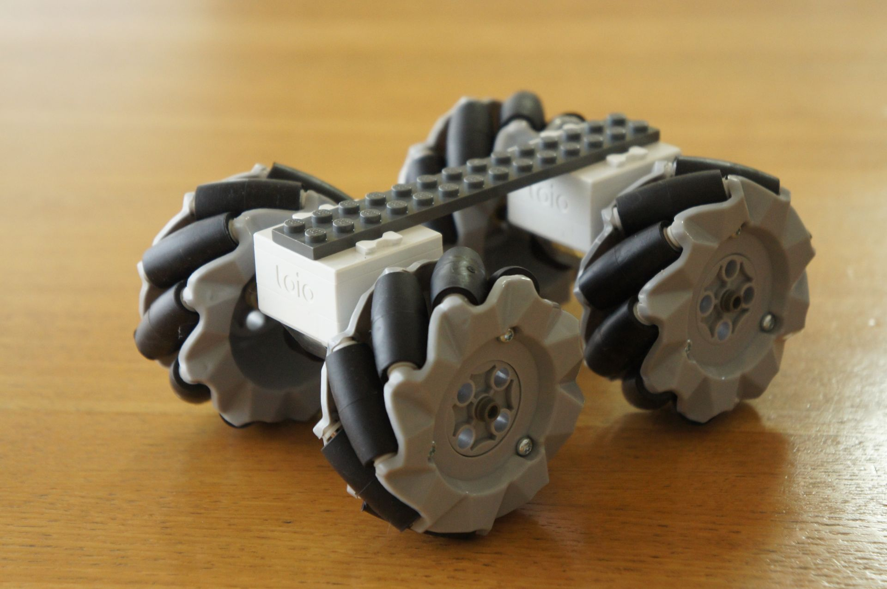
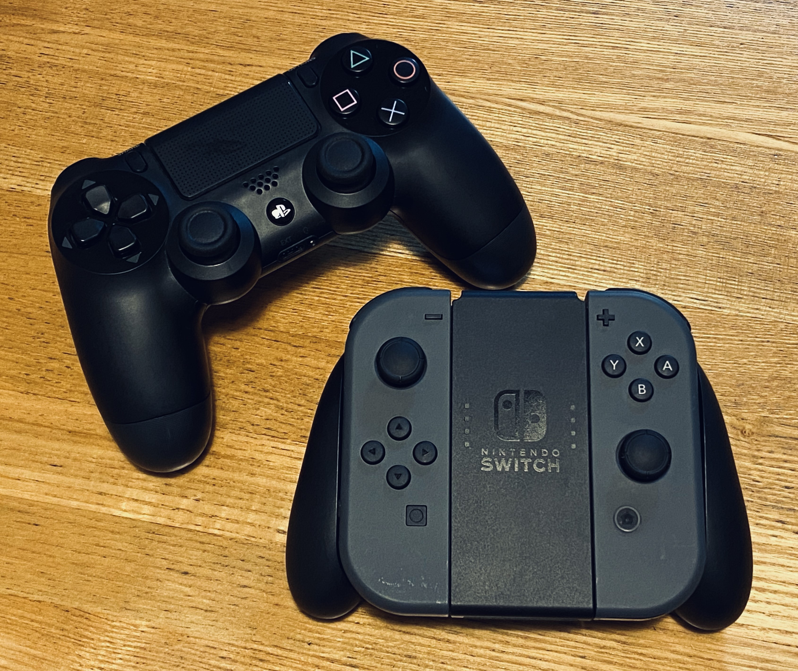
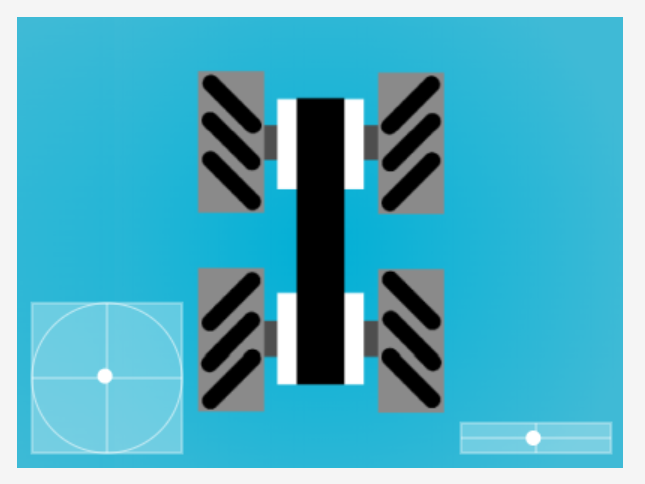
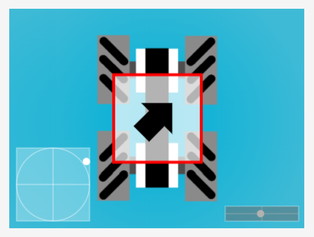
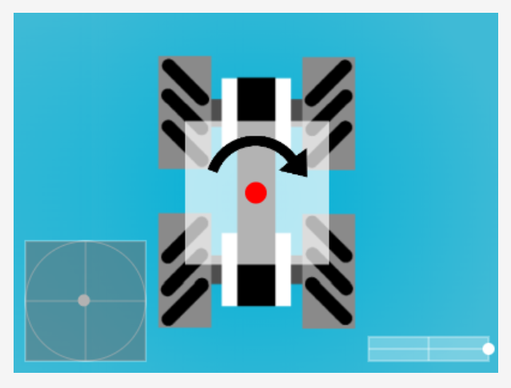
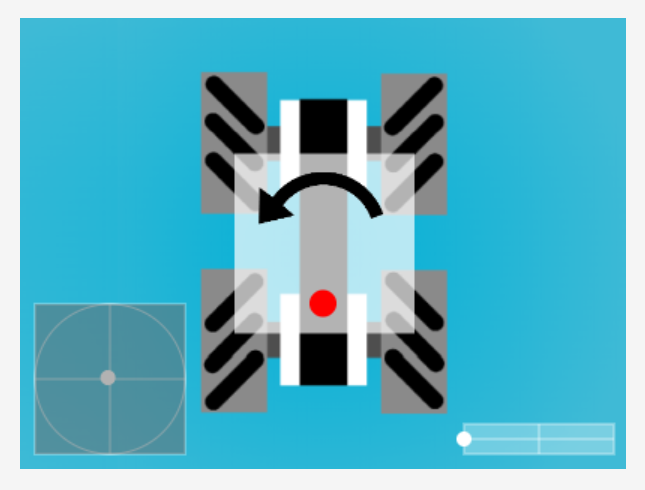
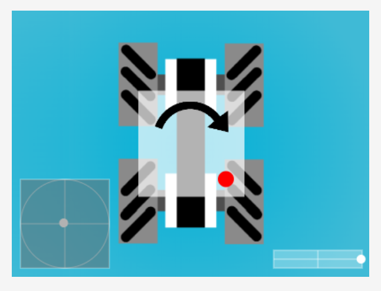
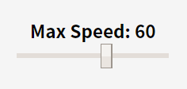
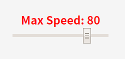

# Mechanum Wheel Control via WebBluetooth
Version 1.0.0  

# Description
A tool enables us to control an omni-directional(by 4 mechanum wheels) robot consisting of 2 toio™Core Cubes via WebBluetooth.  
See [this article](https://qiita.com/tetunori_lego/items/37477c40b16f8eab384f) in detail. You can try [here](https://tetunori.github.io/MechanumWheelControlWebBluetooth/).  
Now, WebBluetooth works on the limited browser/OS. Please check the support status on [Can I Use](https://caniuse.com/#feat=web-bluetooth).

# Usage
## Preparation
### Hardware
1. Assemble mechanum wheel car acording to [this article](https://qiita.com/tetunori_lego/items/37477c40b16f8eab384f). 
2. Turn two Cubes on.
3. (Optional) Prepare DUALSHOCK 4 or Joy-Con(L&R), then pair the gamepad and PC beforehand. 

### Software
1. Open [this tool](https://tetunori.github.io/MechanumWheelControlWebBluetooth/). Google Chrome is highly recommended.
2. (Optional) Push the PS/Home button on the gamepad. You will see the gamepad icon active in the canvas. 
3. Press "Connect Cube 1/2" button, then you can select and connect Cubes one by one.
4. If the tool is ready, the canvas shows the images below. 
5. Additionally, check the head/tail cube are set correctly by using the method below.

## Screen Description

## Operation
|Category|Key Op.|Gamepad Op. DUALSHOCK 4/Joy-Con|Screen/UI Example|
|---|---|---|---|
|Omni-direction move|8 directions by ↑/↓/←/→|Left analog stick (with ✕/B button, limit to 8 directions. Frame color: Red.)|
|Turn around center (red point)|r + ←/→|Right analog stick||
|Turn around Head/tail (red point)|h/t + ←/→|↑/↓ + right analog stick||
|Turn around l/r wheel (red point) |d/f + ←/→|←/→ + right analog stick||
|Exchange Head/Tail|Q key|Option/+ button|Light Head Cube in white.|
|Reset setting|ESC key|PS/Home button||
|Select gamepad|N/A|PS/Home button||
|Adjust speed discretely|-/+ key|L1/R1, L/R button| Default value is 60.|
|Adjust speed continuously|N/A|〇 button + L2 trigger button. (Joy-Con does not support this function.)| You can operate slider directly. |
## Working demo movie
(will update...)

# Licence
This software is released under the MIT License, see LICENSE.

# Author
Tetsunori NAKAYAMA.

# References
toio™
https://toio.io/

toio™Core Cube Specification
https://toio.github.io/toio-spec/

HTML5 Gamepad Specification
https://www.w3.org/TR/gamepad/

HTML5 Gamepad Tester  
https://html5gamepad.com/  

Arrow in canvas
http://www.inazumatv.com/contents/archives/7093

Icon
https://material.io/resources/icons/

UI parts
https://www.muicss.com/
