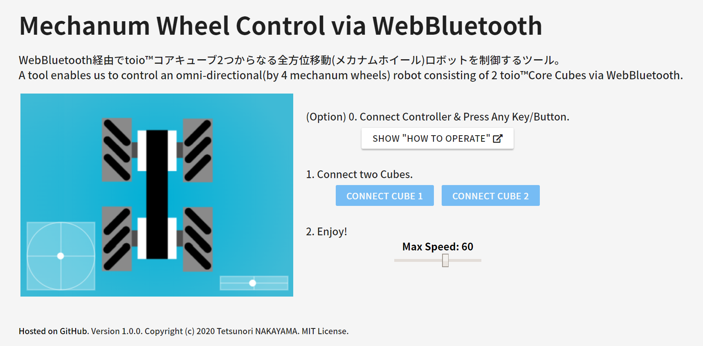

# Mechanum Wheel Control via WebBluetooth
Version 1.0.0 

# Description
A tool enables us to control an omni-directional(by 4 mechanum wheels) robot consisting of 2 toio™Core Cubes via WebBluetooth.  
See [this article](https://qiita.com/tetunori_lego/items/37477c40b16f8eab384f) in detail. You can try [here](https://tetunori.github.io/MechanumWheelControlWebBluetooth/).

# Usage

# Licence
This software is released under the MIT License, see LICENSE.

# Author
Tetsunori NAKAYAMA.

# References
HTML5 Gamepad Specification
https://www.w3.org/TR/gamepad/

HTML5 Gamepad Tester  
https://html5gamepad.com/  

Arrow in canvas
http://www.inazumatv.com/contents/archives/7093

Icon
https://material.io/resources/icons/

UI parts
https://www.muicss.com/
